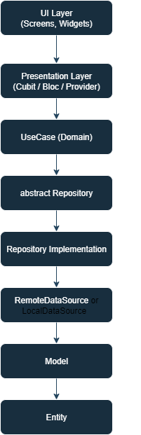

## Clean Architecture
### 1-domain
(entities - repository - use_case) 
### 2-data
(models - data_source - repository)
### 3-presentation
(controller - screens)

---
> start with domain layer
- 1- first entities >> only data that i need بعمل فيها ال انا بستخدمه بس من الريسبونس
- 2- second repository >> (فيها اكتر من داله) بعمل فيها الداله ال انا عايزه انفذها
- 3- third use_case >>(عباره عن داله واحده بس) باخذ ريفرنس من الريبو وانفذ بقي الداله ال في الريبو هنا
> then data layer
- 1- first models >> make all model here and extent it from entity
- 2- data source >> remote(dio) & local(hive) for ex
- 3- repository >> make implement to repo that from domain layer and take refrence from data source
> then presentation layer
- 1- controller(cubit)
- 2- screens
--- 

- الـ Domain Layer مستقلة تمامًا عن أي حاجة تخص API أو Dio أو JSON.
- لو بعدين غيرت طريقة جلب البيانات (من API إلى Local مثلاً)، مش هتعدل ولا سطر في usecases.
- هنا في ال clean code arch لما تستخدم LoginUser في Cubit، أنت كده بتشغل منطق العمل فقط بدون ما تعرف مين بينفذه أو إزاي.
---
### 🎨 تخيل العلاقة بينهم كده:

- يبدأ الـ UI (مثل الشاشة أو الزر) بطلب تسجيل الدخول من خلال الـ Cubit.
- يقوم الـ Cubit باستدعاء الـ UseCase المخصص، مثل LoginUser.
- يتواصل الـ UseCase مع واجهة الـ Repository (LoginRepository) المعرّفة في طبقة الـ domain.
- تُنفذ العملية فعليًا داخل LoginRepositoryImpl الموجود في طبقة البيانات (data).
- تعتمد الـ Repository على LoginRemoteDataSource للتعامل مع API أو البيانات البعيدة.
- يرجع الـ API البيانات في شكل UserModel.
- يتم تحويل الـ UserModel إلى كائن من نوع User (وهو الـ Entity المستخدم داخل التطبيق).
- تُعاد النتيجة إلى الـ Cubit، الذي يقوم بتحديث الحالة (state) بناءً على النتيجة لعرضها في الـ UI.
